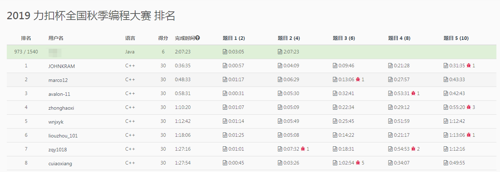

# 2019 力扣杯全国秋季编程大赛

## 2019 力扣杯全国秋季编程大赛

### 1. 猜数字
>小A 和 小B 在玩猜数字。小B 每次从 1, 2, 3 中随机选择一个，小A 每次也从 1, 2, 3 中选择一个猜。他们一共进行三次这个游戏，请返回 小A 猜对了几次？
 
>输入的guess数组为 小A 每次的猜测，answer数组为 小B 每次的选择。guess和answer的长度都等于3。
 
 示例 1：
 
 输入：guess = [1,2,3], answer = [1,2,3]
 输出：3
 解释：小A 每次都猜对了。
  
 
 示例 2：
 
 输入：guess = [2,2,3], answer = [3,2,1]
 输出：1
 解释：小A 只猜对了第二次。
  
 
 限制：
 
 guess的长度 = 3
 answer的长度 = 3
 guess的元素取值为 {1, 2, 3} 之一。
 answer的元素取值为 {1, 2, 3} 之一。
 
 ```java
class Solution {
    public int game(int[] guess, int[] answer) {
        int count = 0;
        for (int i = 0; i < 3; i++) {
            if (guess[i] == answer[i]) {
                count++;
            }
        }
        return count;
    }
}
```

### 2. 分式化简
有一个同学在学习分式。他需要将一个连分数化成最简分数，你能帮助他吗？


连分数是形如上图的分式。在本题中，所有系数都是大于等于0的整数。

输入的cont代表连分数的系数（cont[0]代表上图的a0，以此类推）。返回一个长度为2的数组[n, m]，使得连分数的值等于n / m，且n, m最大公约数为1。 

示例 1：

输入：cont = [3, 2, 0, 2]
输出：[13, 4]
解释：原连分数等价于3 + (1 / (2 + (1 / (0 + 1 / 2))))。注意[26, 8], [-13, -4]都不是正确答案。
示例 2：

输入：cont = [0, 0, 3]
输出：[3, 1]
解释：如果答案是整数，令分母为1即可。
限制：

cont[i] >= 0
1 <= cont的长度 <= 10
cont最后一个元素不等于0
答案的n, m的取值都能被32位int整型存下（即不超过2 ^ 31 - 1）。

```java
class Solution {
    public int[] fraction(int[] cont) {
        int n = cont[cont.length - 1], m = 1;
        for (int i = cont.length - 2; i >= 0; i--) {
            int tmp = n;
            n = m + cont[i] * n;
            m = tmp;
        }
        return new int[]{n, m};
    }
}
```

### 3. robot
>期间加班没时间做，第三题最后有时间，还tm遭遇断网。。。
```java
class Solution {
    public boolean robot(String command, int[][] obstacles, int x, int y) {
            Set<String> set = new HashSet<>();
            for (int i = 0; i < obstacles.length; i++) {
                for (int j = 0; j < obstacles[0].length; j++) {
                    if (obstacles[i][j] > 0) {
                        set.add(i + "_" + j);
                    }
                }
            }
            int a = 0, b = 0;
            while (true) {
                for (char c : command.toCharArray()) {
                    if (c == 'U') {
                        b++;
                    } else {
                        a++;
                    }
                    if (set.contains(a + "_" + b)) {
                        return false;
                    } else if (a > x || b > y) {
                        return false;
                    } else if (a == x && b == y) {
                        return true;
                    }
                }
            }
        }
}
```

## 排名

